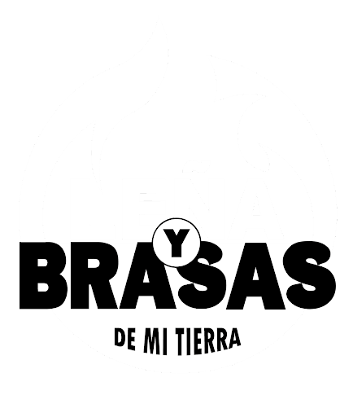
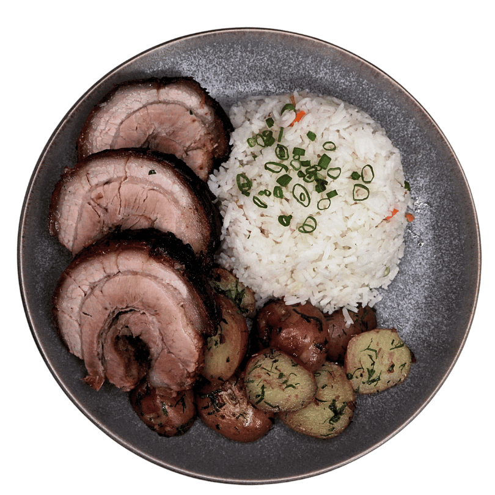
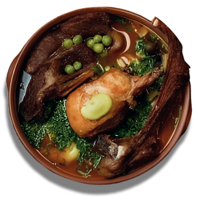
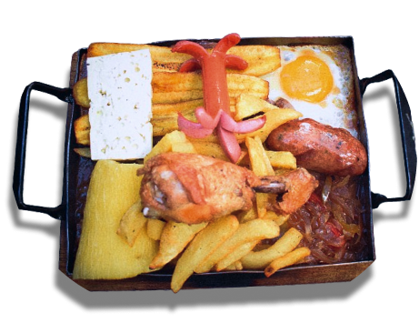
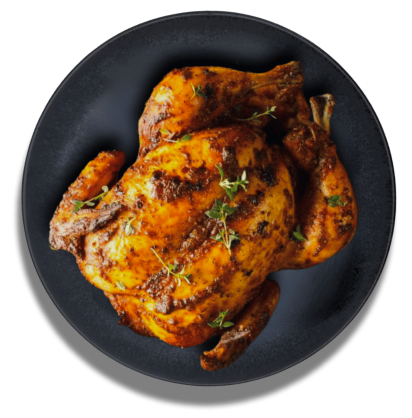
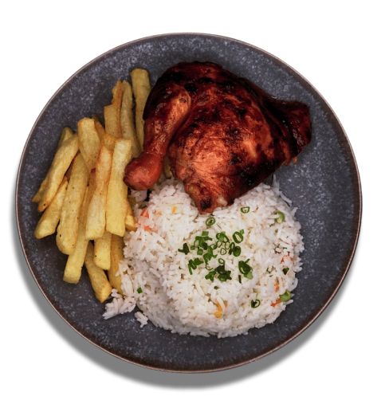
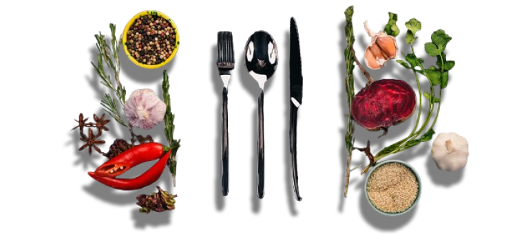
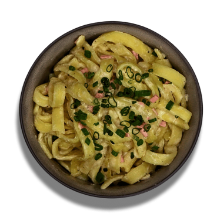
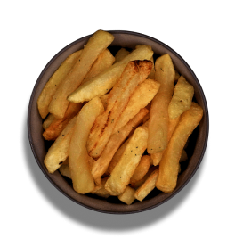

# lea-y-brasas-de-mi-tierra
Pagina web informativa para restaurante
<!DOCTYPE html>
<html lang="es">
  <head>
    <meta charset="UTF-8" />
    <meta name="viewport" content="width=device-width, initial-scale=1.0" />
    <link rel="stylesheet" href="style/inicio.css" />
    <link rel="stylesheet" href="style/fonts.css" />
    <link rel="stylesheet" href="style/nav-fotter.css">
    <link
      rel="shortcut icon"
      href="public/logos/logo.png"
      type="image/x-icon"
    />
    <title>Leña y Brasas</title>
  </head>
  <body>
    <!-- 

    
 -->
    <header class="header">
      <nav class="header__nav">
        <ul class="nav__container--items">
          <li class="nav-items"><a href="menu.html">MENÚ</a></li>
          <li class="nav-items"><a href="promociones.html">PROMOCIÓN</a></li>
          
          <li class="nav-items"><a href="resevas.html">RESERVA</a></li>
          <li class="nav-items"><a href="contacto.html">CONTACTO</a></li>
        </ul>
      </nav>
      <main class="header__main">
        

          <h1>100% A LA BRASA</h1>
          <h2>CON UN TOQUE NACIONAL</h2>
          <button>VER MENÚ</button>
        

        
        
        
        
        
      </main>
    </header>

    <section class="frase">
      <h2>" EL AMOR SE TRANSMITE EN LA COMIDA "</h2>
      
    </section>

    <aside class="menu">
      
      
      
      

        
        

          <h3>FIDEOS UCHU</h3>
          

            Fideo cocido en aji con especias, decorado con cilantro y perejil,
            acompañado con papa cocida y sus carnes de pollo frito, costilla de
            cordero y kawi de res.
          

          <a href="menu.html">VER MENU >></a>
        

      

      

        

          <h3>COSTILLITADE CHANCHITO A LA BRASA</h3>
          

            Costilla de cerdo cocido a fuego ardiente en BRASA, acompañado con
            papas rusticas(papa huayco tostada con matequilla, cebolla y ajo) y
            nuestro arroz primavera.
          

          <a href="menu.html">VER MENU >></a>
        

        
        
      

      

        
        

          <h3>PLANCHITA</h3>
          

            Chuleta de res y cerdo, salchicha, chorizo y pollo cocidas en
            plancha, acompañada de papas fritas, huevo frito, postre frito,
            huevo frito, queso, yuca, chorrellana y su porciòn de arroz.
          

          <a href="menu.html">VER MENU >></a>
        

      

      

        

          <h3>PolloSA LA BRASA</h3>
          

            Pollos con corte de 1/4 y 1/8 cocido a la BRASA acompañado con dos
            guarniciones a elecciòn las cuales puedes elegir a continuación.
          

          <a href="menu.html">VER MENU >></a>
        

        
        
      

    </aside>
    <section class="container__guarniciones">
      

        
        

          <h3>GUARNICIONES</h3>
          
(DOS GUARNICIONES A ELECCION PARA ACOMPAÑAR TU POLLO)

        

        
      

      

        <svg xmlns="http://www.w3.org/2000/svg" viewBox="0 0 24 24" class="arrow-izquierda"><path d="M15.293 3.293 6.586 12l8.707 8.707 1.414-1.414L9.414 12l7.293-7.293-1.414-1.414z"/></svg>
    <svg xmlns="http://www.w3.org/2000/svg" viewBox="0 0 24 24" class="arrow-derecha"><path d="M7.293 4.707 14.586 12l-7.293 7.293 1.414 1.414L17.414 12 8.707 3.293 7.293 4.707z"/></svg>
        

          
          <h4>FIDEO FETUCHINI</h4>
        

        

          
          <h4>PAPAS COCIDAS</h4>
        

        

          
          <h4>PAPAS FRITAS</h4>
        

      

    </section>

    <footer class="footer">
      
      <section class="menu-footer">
        <ul>
          <li><a href="menu.html">MENU</a></li>
          <li><a href="promociones.html">PROMOCIONES</a></li>
          <li><a href="reservas.html">RESERVAS</a></li>
          <li><a href="contacto">CONTACTO</a></li>
        </ul>
      </section>
      <section class="redes">
        

          
        

        

          
        

        

        

        

      </section>
      <section class="horarios">
        <h3>HORARIO DE ATENCION</h3>
        <h3>11:00 AM - 17:00 PM</h3>
        <h3>DE JUEVES A DOMINGO</h3>
      </section>
      <h5>DERECHOS RESERVADOS PARA LEÑA Y BRASAS DE MI TIERRA</h5>
    </footer>

    
  </body>
</html>
